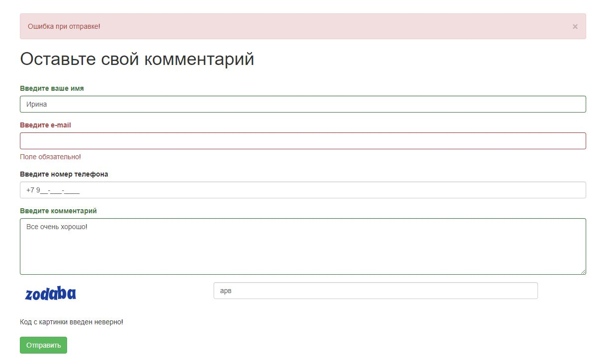
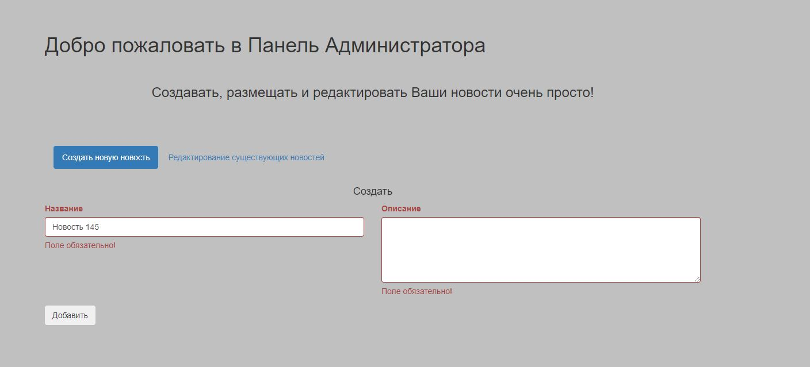
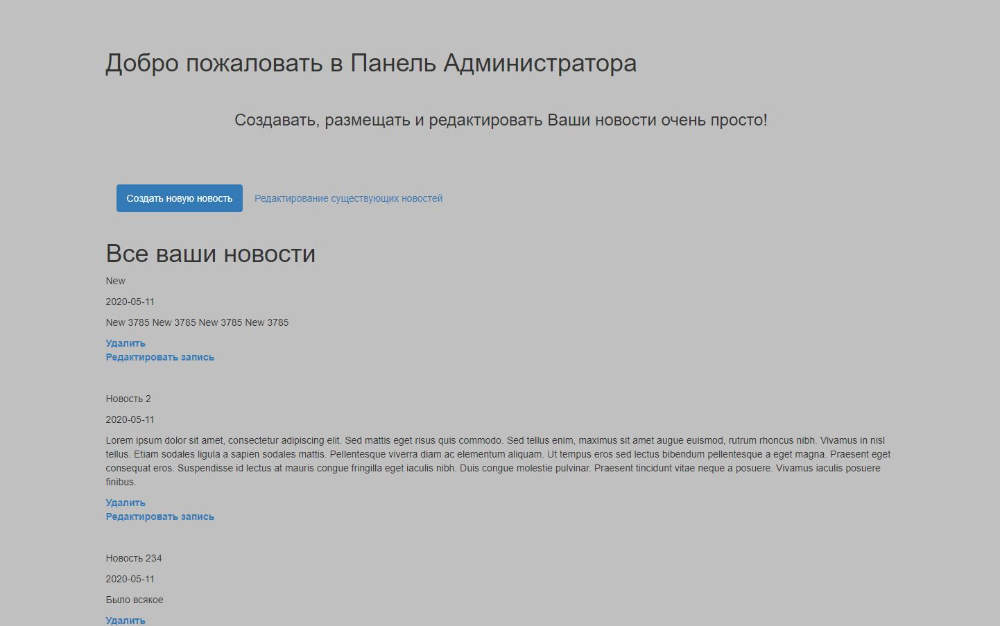
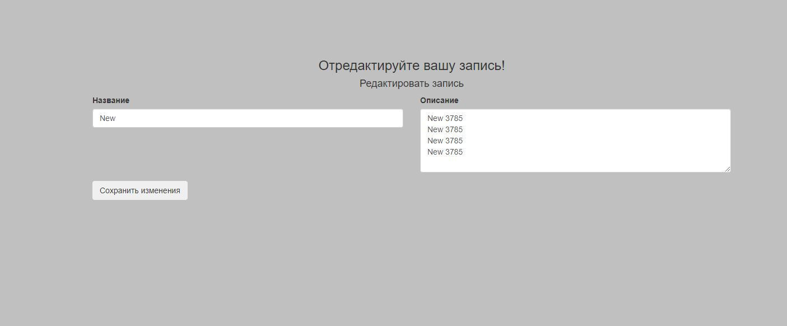

<h1>Моё портфолио</h1>

<h4>В проекте реализовано:</h4>

<ul> 
<li>Форма обратной связи с валидацией полей и отправкой информации из формы на почту. Форма осушествляет проверку телефона по маске, e-mail по фильтру email, фильтрацию на пустоту полей, капча. Это реализовано в контроллере MainController, в представлении index, форма реализована в Модели KommentForm   </li>

<li>Контакты для отправки данных на почту прописаны: config/params.php</li>
<li>Прототип Админ панели с занесением своих записей в базу данных. Это реализовано в контроллере AdminController, в представлении create, форма реализована в Модели NoteForm, таблица БД в Модели NotesTable </li>

<li>База данных подключена в config/db.php</li>
<li>Вывод записей таблицы БД в представлении list с сортировкой: сначала последние</li>

<li>Возможность редактировать и удалять записи БД в АДмин панели. Это реализовано в контроллере AdminController, в представлении edit и list, форма реализована в Модели NoteForm, таблица БД в Модели NotesTable</li>

<li>Подключение шаблона оформления страниц: layout/basic.php</li>
<li>Подключение css стилей в AdminController</li>
</ul>